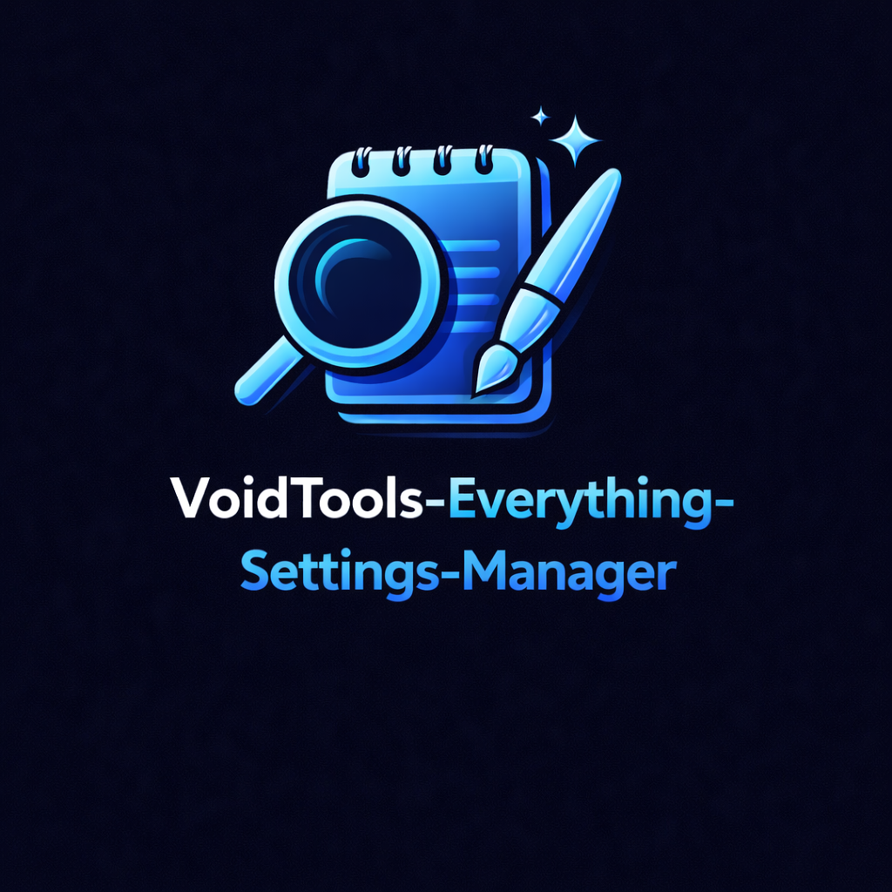

<!-- codex-branding:start -->
<p align="center"></p>

<p align="center">
  
  
  
</p>
<!-- codex-branding:end -->

# Everything Settings Manager

A comprehensive PowerShell WPF GUI application for managing [Everything](https://www.voidtools.com/) search utility settings, with full support for INI configuration and CSV data editing.


## Features

### Settings Management
- **Auto-detection** of Everything INI files (supports stable and beta versions like `Everything-1.5a.ini`)
- **13 categorized setting groups** with visual impact indicators (Critical, High, Medium)
- **100+ configurable settings** with descriptions and recommended values
- **One-click backup** before making changes
- **Apply Recommended** button to quickly optimize settings

### CSV Editor
- Edit **Filters**, **Bookmarks**, **Search History**, and **Run History**
- **Add Defaults** button with curated filter and bookmark templates
- Full DataGrid editing with add/delete row support
- Automatic backup before saving
- Everything process management (auto-close and restart)

### User Interface
- Modern dark theme throughout
- Dual-tab interface (Settings | CSV Editor)
- Real-time Everything process status indicator
- Change tracking with modified count display

## Installation

No installation required. Simply download and run:

```powershell
powershell -ExecutionPolicy Bypass -File EverythingSettingsManager.ps1
```

## Requirements

- Windows 10/11
- PowerShell 5.1 or later
- [Everything](https://www.voidtools.com/) search utility installed

## Settings Categories

| Category | Description | Key Settings |
|----------|-------------|--------------|
| **Database** | Database persistence and backup | `db_save_on_exit`, `db_auto_save_on_close` |
| **Indexing** | What gets indexed | `index_size`, `index_folder_size`, `fast_size_sort` |
| **NTFS** | USN Journal and NTFS features | `journal`, `ntfs_open_file_by_id` |
| **Volumes** | Auto-include volume types | `auto_include_fixed_volumes` |
| **Folders** | Folder indexing behavior | `folder_update_rescan_asap` |
| **Exclusions** | Exclude paths/patterns | `exclude_folders`, `exclude_files` |
| **Performance** | Threading and memory | `max_threads`, `reuse_threads` |
| **Interface** | UI and tray settings | `run_in_background`, `show_tray_icon` |
| **History** | Search and run history | `search_history_enabled`, `run_history_enabled` |
| **Advanced** | Debug and plugin options | `debug`, `plugins` |

## Default Templates

### Filters (26 defaults)
- **File Types**: AUDIO, COMPRESSED, DOCUMENT, EXECUTABLE, FOLDER, IMAGE, VIDEO
- **Specialized**: LARGE_FILES (>1GB), TEMP_FILES, PSD, CODE, ISO_IMAGES, EXE_DLL, FONTS, SCRIPTS, PYTHON
- **Time-based**: RECENT_24H, RECENT_7DAYS
- **Attributes**: EMPTY_FILES, EMPTY_FOLDERS, HIDDEN_FILES, DUPLICATES, LONG_PATHS

### Bookmarks (28 defaults)
- **Everything Views**: By Name, By Recents, By Size
- **File/Folder Filters**: Files Only, Folders Only, Empty Folders
- **Date Filters**: Recent 24 Hours, Recent 7 Days
- **Size Filters**: Small Files (<5MB), Large Files (>50MB), Big Files (>2GB), Massive Files (>3GB)
- **Utilities**: Duplicates, Long Paths (>250), Hidden Files, PowerShell Scripts

## Usage Tips

### Preventing Database Rescans
The most important settings to prevent full rescans on startup:

1. **Enable USN Journal**: `journal=1` (Critical)
2. **Save database on exit**: `db_save_on_exit=1` (Critical)
3. **Disable folder size indexing**: `index_folder_size=0` (High - causes rescans if enabled)
4. **Run in background**: `run_in_background=1` (Keeps database current)

### Recommended Workflow
1. Launch the tool
2. Review settings with "Critical" and "High" impact badges
3. Click "Apply Recommended" for optimal configuration
4. Create a backup before saving
5. Save and restart Everything

## File Locations

| File Type | Default Location |
|-----------|------------------|
| INI Settings | `%APPDATA%\Everything\Everything.ini` or `Everything-1.5a.ini` |
| Filters CSV | `%APPDATA%\Everything\Filters.csv` or `Filters-1_5a.csv` |
| Bookmarks CSV | `%APPDATA%\Everything\Bookmarks.csv` or `Bookmarks-1_5a.csv` |
| Backups | `%APPDATA%\Everything\Backups\` |

## Contributing

Contributions are welcome! Please feel free to submit a Pull Request.

## License

This project is licensed under the MIT License - see the [LICENSE](LICENSE) file for details.

## Acknowledgments

- [voidtools](https://www.voidtools.com/) for creating the excellent Everything search utility
- The Everything community for documentation on INI settings

## Disclaimer

This tool modifies Everything configuration files. Always create backups before making changes. The author is not responsible for any data loss or issues arising from the use of this tool.
