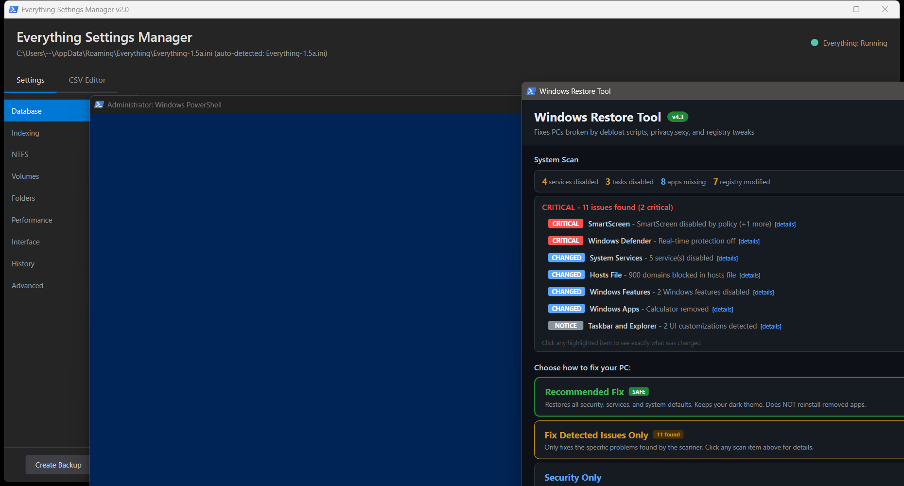

# MonitorControl Pro

<p align="center">
  
  
  
  
</p>

A comprehensive Windows GUI utility for controlling monitor settings via DDC/CI protocol. Adjust brightness, contrast, color temperature, input sources, and more — all without touching your monitor's physical buttons.


*Add your own screenshot*

## Features

### Display Controls
- **Brightness & Contrast** — Real-time adjustment via DDC/CI
- **RGB Gain Control** — Fine-tune red, green, and blue channels independently
- **Color Temperature Presets** — Quick access to Warm (5000K), 6500K (D65), Cool (9300K), and sRGB
- **Sharpness Control** — Adjust display sharpness if supported

### Monitor Management
- **Visual Monitor Layout** — Click-to-select interface matching Windows Display Settings
- **Input Source Switching** — Switch between HDMI, DisplayPort, USB-C, DVI, VGA
- **Power Control** — Turn monitors On, Standby, or Off via software
- **Apply to All Monitors** — Sync settings across all connected displays
- **Monitor Identification** — On-screen overlays showing monitor numbers

### Automation
- **Auto Mode** — Automatic brightness and color temperature based on time of day:
  - Day (7 AM - 6 PM): 80% brightness, neutral colors
  - Evening (6 PM - 9 PM): 60% brightness, slightly warm
  - Night (9 PM - 7 AM): 40% brightness, warm/reduced blue light
- **Profile System** — Save and load custom configurations
- **Command-line Support** — Launch minimized or with a specific profile

### Advanced Features
- **VCP Explorer** — Query and set any VCP code for advanced users
- **VCP Code Scanner** — Discover which DDC/CI features your monitor supports
- **DDC/CI Capabilities Viewer** — View raw capabilities string from monitor
- **Software Gamma Control** — Independent RGB gamma curves via Windows API
- **Factory Reset** — Reset monitor to factory defaults (colors only or full reset)

### GPU Monitoring (NVIDIA)
- Real-time temperature, utilization, and clock speed
- Memory usage and fan speed
- Power draw monitoring
- Digital vibrance slider (placeholder for NVAPI integration)

## Requirements

- **Windows 10/11**
- **PowerShell 5.1+** (included with Windows)
- **DDC/CI Compatible Monitor** — Most modern monitors support this; ensure it's enabled in your monitor's OSD settings
- **NVIDIA GPU** (optional) — For GPU monitoring tab

## Installation

### Option 1: Direct Download
1. Download `MonitorControlPro.ps1`
2. Right-click and select "Run with PowerShell"

### Option 2: From PowerShell
```powershell
# Download and run
irm https://raw.githubusercontent.com/YOUR_USERNAME/MonitorControlPro/main/MonitorControlPro.ps1 -OutFile MonitorControlPro.ps1
.\MonitorControlPro.ps1
```

### Option 3: Create a Shortcut
```powershell
# Create a desktop shortcut
$WshShell = New-Object -ComObject WScript.Shell
$Shortcut = $WshShell.CreateShortcut("$env:USERPROFILE\Desktop\MonitorControl Pro.lnk")
$Shortcut.TargetPath = "powershell.exe"
$Shortcut.Arguments = "-ExecutionPolicy Bypass -WindowStyle Hidden -File `"$PWD\MonitorControlPro.ps1`""
$Shortcut.IconLocation = "imageres.dll,109"
$Shortcut.Save()
```

## Usage

### Basic Usage
```powershell
.\MonitorControlPro.ps1
```

### Command-Line Parameters
```powershell
# Start minimized (useful for startup)
.\MonitorControlPro.ps1 -StartMinimized

# Load a specific profile on launch
.\MonitorControlPro.ps1 -LoadProfile "Gaming"

# Combined
.\MonitorControlPro.ps1 -StartMinimized -LoadProfile "Night Mode"
```

### Keyboard Navigation
- Click on monitor rectangles to select different displays
- Use Tab to navigate between controls
- Slider values update in real-time

## VCP Code Reference

The VCP Explorer tab allows you to query and set any DDC/CI VCP code. Common codes:

| Code | Name | Range | Description |
|------|------|-------|-------------|
| `0x10` | Brightness | 0-100 | Display brightness level |
| `0x12` | Contrast | 0-100 | Display contrast level |
| `0x14` | Color Preset | varies | Color temperature preset |
| `0x16` | Red Gain | 0-100 | Red channel gain |
| `0x18` | Green Gain | 0-100 | Green channel gain |
| `0x1A` | Blue Gain | 0-100 | Blue channel gain |
| `0x60` | Input Source | varies | Active input selection |
| `0x62` | Volume | 0-100 | Speaker volume (if available) |
| `0x87` | Sharpness | 0-100 | Image sharpness |
| `0x8D` | Audio Mute | 1/2 | Mute speakers |
| `0xD6` | Power Mode | 1-5 | Power state control |
| `0x04` | Factory Reset | 1 | Reset all settings |
| `0x08` | Color Reset | 1 | Reset color settings only |

### Input Source Values
| Value | Input |
|-------|-------|
| `0x01` | VGA |
| `0x03` | DVI |
| `0x0F` | DisplayPort 1 |
| `0x10` | DisplayPort 2 |
| `0x11` | HDMI 1 |
| `0x12` | HDMI 2 |
| `0x13` | USB-C |

### Power Mode Values
| Value | State |
|-------|-------|
| `0x01` | On |
| `0x02` | Standby |
| `0x04` | Off |

## Profiles

Profiles are saved as JSON files in `%APPDATA%\MonitorControlPro\`

### Profile Contents
```json
{
  "Name": "Gaming",
  "Brightness": 80,
  "Contrast": 70,
  "Red": 50,
  "Green": 50,
  "Blue": 50,
  "Gamma": 100,
  "GammaRed": 100,
  "GammaGreen": 100,
  "GammaBlue": 100
}
```

### Example Profiles

**Night Mode** — Reduced brightness and blue light
```json
{
  "Name": "Night Mode",
  "Brightness": 35,
  "Contrast": 50,
  "Red": 50,
  "Green": 48,
  "Blue": 40,
  "Gamma": 100,
  "GammaRed": 100,
  "GammaGreen": 95,
  "GammaBlue": 80
}
```

**Photography** — Accurate colors for editing
```json
{
  "Name": "Photography",
  "Brightness": 50,
  "Contrast": 50,
  "Red": 50,
  "Green": 50,
  "Blue": 50,
  "Gamma": 100,
  "GammaRed": 100,
  "GammaGreen": 100,
  "GammaBlue": 100
}
```

## Troubleshooting

### Monitor Not Detected
1. **Enable DDC/CI** — Check your monitor's OSD settings for DDC/CI option and ensure it's enabled
2. **Check Cable** — DDC/CI works best over DisplayPort and HDMI; some adapters don't pass through DDC/CI signals
3. **Try Different Port** — Some monitor ports may have DDC/CI disabled

### Settings Not Applying
- Some monitors have a delay (~50ms per command)
- Certain VCP codes may not be supported by your specific monitor
- Use the VCP Scanner to discover which features your monitor actually supports

### Laptop Display Not Working
Laptop integrated displays typically don't support DDC/CI. Use Windows brightness controls or WMI-based tools instead.

### "No DDC/CI Monitor" Message
Your monitor either:
- Doesn't support DDC/CI
- Has DDC/CI disabled in OSD
- Is connected through an incompatible adapter/dock

## Technical Details

### APIs Used
- **dxva2.dll** — Windows DDC/CI implementation
  - `GetPhysicalMonitorsFromHMONITOR`
  - `GetVCPFeatureAndVCPFeatureReply`
  - `SetVCPFeature`
  - `CapabilitiesRequestAndCapabilitiesReply`
- **gdi32.dll** — Software gamma control
  - `SetDeviceGammaRamp`
- **user32.dll** — Monitor enumeration
  - `EnumDisplayMonitors`
  - `GetMonitorInfo`

### Data Storage
- Profiles: `%APPDATA%\MonitorControlPro\*.json`
- No registry modifications
- No admin rights required

## Inspiration & Credits

This project was inspired by and incorporates concepts from these excellent open-source projects:

- **[Twinkle Tray](https://github.com/xanderfrangos/twinkle-tray)** — System tray brightness control, time-based automation
- **[Monitorian](https://github.com/emoacht/Monitorian)** — Clean WPF implementation, unison mode concept
- **[ControlMyMonitor](https://www.nirsoft.net/utils/control_my_monitor.html)** — Comprehensive VCP exploration
- **[MonitorConfig](https://github.com/MartinGC94/MonitorConfig)** — PowerShell DDC/CI module
- **[LightBulb](https://github.com/Tyrrrz/LightBulb)** — Gamma-based color temperature
- **[display-switch](https://github.com/haimgel/display-switch)** — Input source switching concepts

## Contributing

Contributions are welcome! Please feel free to submit a Pull Request.

### Development Setup
1. Clone the repository
2. Edit `MonitorControlPro.ps1` in your preferred editor (VS Code with PowerShell extension recommended)
3. Test changes by running the script directly

### Areas for Improvement
- [ ] System tray mode with persistent background operation
- [ ] Hotkey support for quick adjustments
- [ ] Multi-monitor profile linking
- [ ] AMD GPU monitoring support
- [ ] NVAPI integration for digital vibrance
- [ ] WMI fallback for laptop displays
- [ ] Scheduled profile switching
- [ ] Per-application profiles

## License

MIT License — see [LICENSE](LICENSE) for details.

## Disclaimer

This software interacts with monitor hardware via DDC/CI protocol. While DDC/CI is a standard protocol and this software uses official Windows APIs, use at your own risk. The author is not responsible for any damage to monitors or other hardware.

---

<p align="center">
  Made with PowerShell and WPF<br>
  <a href="https://github.com/YOUR_USERNAME/MonitorControlPro/issues">Report Bug</a> · 
  <a href="https://github.com/YOUR_USERNAME/MonitorControlPro/issues">Request Feature</a>
</p>
